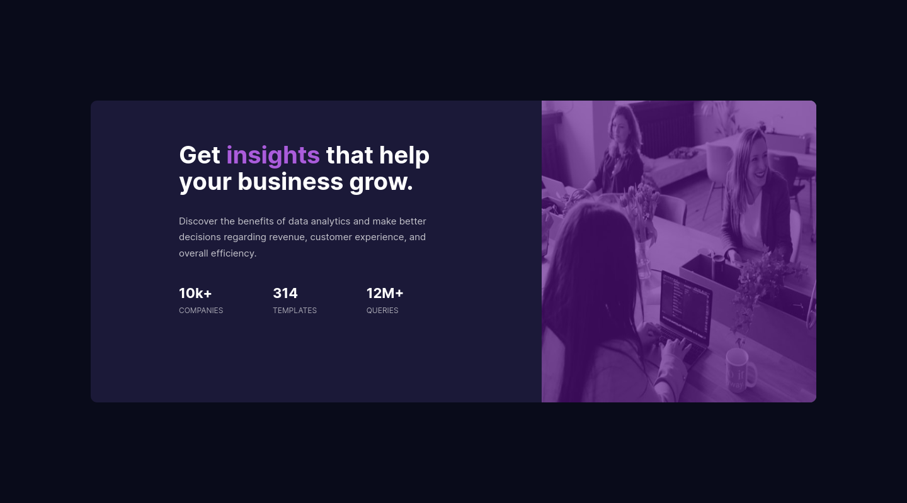

# Frontend Mentor - Stats preview card component solution

This is a solution to the [Stats preview card component challenge on Frontend Mentor](https://www.frontendmentor.io/challenges/stats-preview-card-component-8JqbgoU62). Frontend Mentor challenges help you improve your coding skills by building realistic projects. 

## Table of contents

- [Overview](#overview)
  - [The challenge](#the-challenge)
  - [Screenshot](#screenshot)
  - [Links](#links)
- [My process](#my-process)
  - [Built with](#built-with)
  - [What I learned](#what-i-learned)
  - [Continued development](#continued-development)
  - [Useful resources](#useful-resources)
- [Author](#author)
- [Acknowledgments](#acknowledgments)


## Overview

### The challenge

Users should be able to:

- View the optimal layout depending on their device's screen size

### Screenshot

- Desktop Solution - 1440 Width



- Mobile Solution - 375px Width


### Links

- Solution URL: [Live](https://jehutymsms.github.io/Stat-Card-Page-Project/)

## My process

### Built with

- Semantic HTML5 markup
- CSS custom properties
- Flexbox
- CSS Grid
- Mobile-first workflow

### What I learned

CSS is something I have had some issue's grasping but the below items were difficult for me to graps. I am more of a visual learner so one would think CSS would be easy to grasp. However I believe I have a good handle on it because of this project. Especially Grid and Flexbox.

 - It took me a while to figure out how to do an overlay of a color over the image. I used the stackoverflow question [here](https://stackoverflow.com/questions/9182978/semi-transparent-color-layer-over-background-image) to get this answer. I believe there is a better way to do this but this is the solution I found so far. Code snippet below from Mobile Style Sheet:


```css
#imageContainer:before {
	content: "";
	display: block;
	position: absolute;
	top: 0;
	bottom: 0;
	left: 0;
	right: 0;
	background: hsl(277, 78%, 30%, 0.63);
	border-top-left-radius: 10px;
	border-top-right-radius: 10px;
}
```

- Flexbox was something I mainly used for this project and I would Highly recommend [this](https://css-tricks.com/snippets/css/a-guide-to-flexbox/#background) guide. This gave me a visual of what flexbox does and it was so helpful. Code snippet below from Mobile Style Sheet:

```css
#imageContainer{
	position: relative;
	display: flex;
	justify-content: center;
	align-items: center;
}
```
- I did use Grid as well and again [this](https://css-tricks.com/snippets/css/complete-guide-grid/) site was a great visual representation of what the different syntax do to the items. Code snippet below from Desktop Style Sheet:

```css
#statContainer{
	display: grid;
	grid-template:
    'auto auto auto'
    'auto auto auto';
}
#nuM1{order: 1;}
#nuM2{order: 2;}
#nuM3{order: 3;}
#nuM1id{order: 4;}
#nuM2id{order: 5;}
#nuM3id{order: 6;}
```


### Continued development

Use this section to outline areas that you want to continue focusing on in future projects. These could be concepts you're still not completely comfortable with or techniques you found useful that you want to refine and perfect.

**Note: Delete this note and the content within this section and replace with your own plans for continued development.**

### Useful resources

- [Flexbox Resource](https://css-tricks.com/snippets/css/a-guide-to-flexbox/#background) - This helped me for Flexbox and has amazing visuals.
- [Grid Resource](https://css-tricks.com/snippets/css/complete-guide-grid/) - This helped me for Grid and has amazing visuals.

## Author

- Portfolio - [Andrew Humphries](https://jehutymsms.github.io/)


## Acknowledgments

I would like to thank Odin Project for setting me on this path and giving me the confidence to try this project. 
